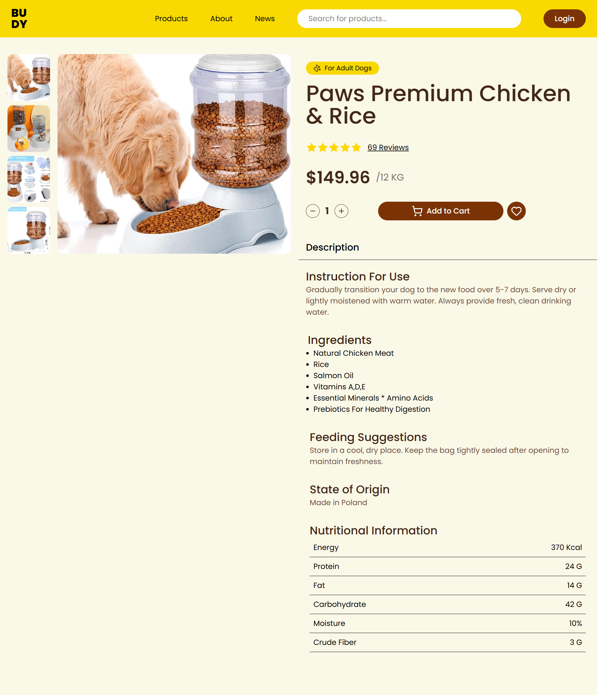

🐶 Pet Food E-commerce UI

A modern and clean Pet Food E-commerce Product Page UI built using React.js, Tailwind CSS, and Vite.
This project focuses on component breaking, props drilling, and converting a real-world design into a scalable React UI.

🎨 Design Credit

This UI is inspired by a Dribbble design by Antonina Panteley.
The project is built strictly for learning and portfolio purposes.

🎯 Project Objective

The main goal of this project is to:
Understand component decomposition
Practice props drilling in React
Build reusable UI components
Follow a feature-based folder structure
Improve real-world design-to-code skills

🛠 Tech Stack

⚛️ React.js
🎨 Tailwind CSS
⚡ Vite
🧩 Lucide Icons
💻 JavaScript (ES6+)

✨ Features

Clean and modern e-commerce product UI
Feature-based component structure
Reusable and composable components
Props-driven data flow
Fully responsive design (Desktop, Tablet & Mobile)
Well-organized and scalable folder structure

📱 Responsive Design
✔ Desktop
✔ Tablet
✔ Mobile

🧩 Component Architecture

UI is broken into small, focused components
Each component has a single responsibility
Data is passed via props to understand real React data flow
Nested folders reflect real production UI structures
Layout and logic are kept clean and readable

🧪 Learning Outcomes

Improved understanding of props drilling
Better component naming and responsibility
Confidence in breaking complex UIs into small pieces
Hands-on experience with Tailwind utility-first styling
Cleaner React project organization

🖼 Preview
Add a screenshot of the project UI here

🔗 **Live Demo:** [View Project](https://cohort-2-0-react-js-1u1o.vercel.app/)

⚠️ Disclaimer

This project is UI only.
No backend, authentication, or payment functionality is implemented.

👤 Author
Muhammad Waleed
Frontend Developer (React.js)

⭐ Credits
UI Design: Antonina Panteley (Dribbble)